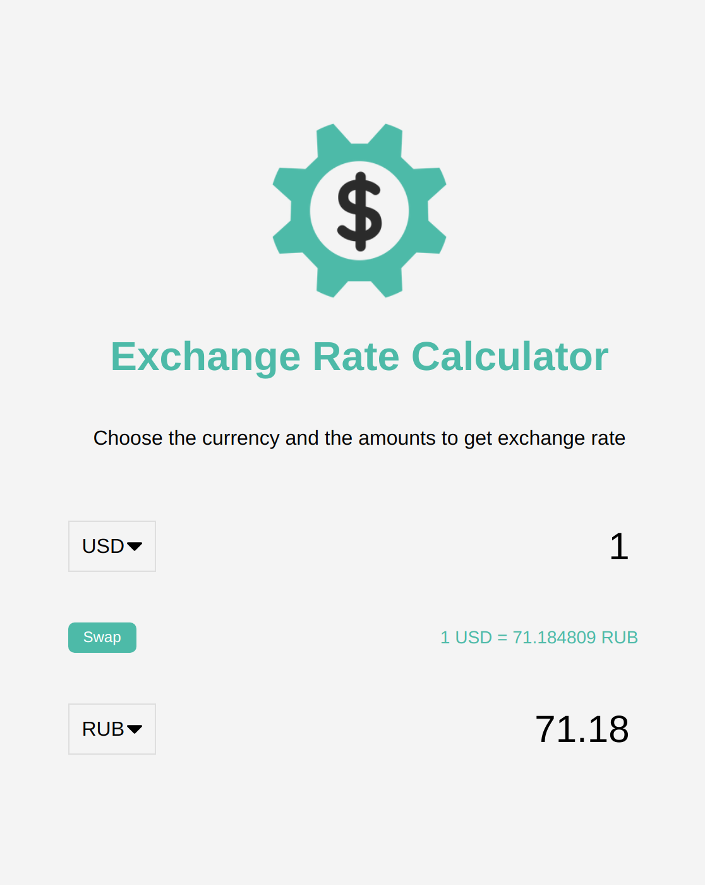

# Exchange-rate-calculator

Exchange rate calculator mini project, using vanilla JavaScript

### Functions:

[The app](https://tn-space.github.io/exchange-rate-calculator/)

The app:

- can show exchange rate between currencies
- show if a currency is in valid (no data)

### Images:

